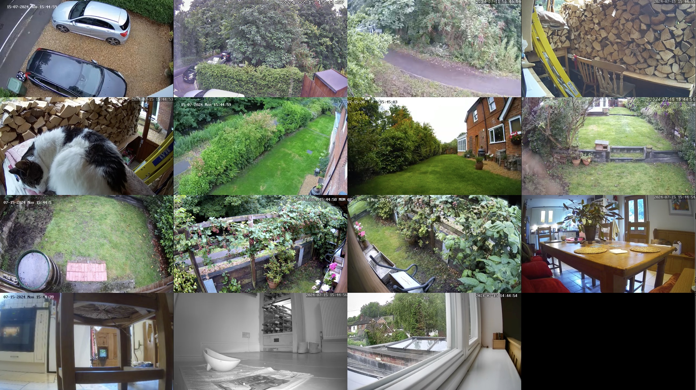

# RTSP Capture CCTV System

## Introduction

This is an RTSP based CCTV system that can be run on a Raspberry Pi 4 (or later). It works with any off the shelf CCTV camera that supports RTSP and converts the video streams from each camera into HLS streams. The HLS streams can be shown natively in Safari on any Apple device e.g. a Macbook, iPhone or iPad.

The philosophy of this system is that it requires very low CPU usage on the Raspberry Pi as it is only translating (not re-encoding) the RTSP streams into HLS streams. For example, on a system with 16 high definition video cameras you can expect to use less than half the available CPU power.

The system will capture at least 3 streams from each CCTV camera:

1. A high definition live stream that is typically delayed by about 10 seconds due to HLS streaming latency
2. A low definition live stream for use in a video mosaic
3. A high definition stream that is continuously recorded

All AV content is written to a USB drive that is connected to the Rasperry Pi. It is recommended to use a solid state disk as this provides blistering performance when playing back content and seeking to times.

## Installation

> These installation steps are based on the Raspberry Pi 4 but they should work just as well on a Raspberry Pi 5.

### Pre-requisites

The following is hardware is recommended:

* A Raspberry Pi 4 (or later)
* A micro SD card
* An external SSD drive
* Ethernet cable for connecting the Pi to your network

Where the SSD drive is concerned, it is recommended to use the biggest drive possible. A 4Tb drive will typically store 2 weeks worth or continous footage from 16 high definition CCTV cameras.

### Step 1: Install Ubuntu Server

<ol>
<li>Download the latest Ubuntu Server image for Raspberry Pi from here: <a href="https://ubuntu.com/download/raspberry-pi">https://ubuntu.com/download/raspberry-pi</a>
<li>Write the image to your SD card. I recommend using Balena Etcher which can be downloaded here: <a href="https://etcher.balena.io](https://etcher.balena.io">https://etcher.balena.io](https://etcher.balena.io</a>
<li>Before you bootup the Pi for the first time, you need to modify the one of the configuration files on the boot partition of the SD card to setup the hostname; your username and your public SSH key for logging in over the network. Mount the SD card on your host and open the following file for editing: /user-data
<li>Add the following configuration to the end of this file, where:
<ul>
<li><b>&lt;hostname&gt;
</b> should be set to the hostname of your Raspberry Pi
<li><b>&lt;username&gt;</b> should be set to your username
<li><b>&lt;ssh_authorized_keys&gt;</b> should be set to your public SSH key
</ul>

<pre>
## Set hostname
hostname: &lt;hostname&gt;
## Configure default user
system_info:
  default_user:
    name: &lt;username&gt;
    ssh_authorized_keys:
      - &lt;your SSH key&gt;
    sudo: ALL=(ALL) NOPASSWD:ALL
</pre>

<li>Insert the SD card into your Raspberry Pi
<li>Connect the Raspberry Pi to your network using an ethernet cable and bootup Ubuntu Server for the first time.
<li>Once booted, login over SSH.
<li>In your SSH terminal, update the available packages:
<pre>sudo apt update</pre>
<li>Upgrade all installed packages:
<pre>sudo apt upgrade</pre>
<li>(optional) I suggest installing the following additional packages to make life easier later:
<pre>
sudo apt install net-tools
sudo apt install htop
</pre>
</ol>

### Step 2: Install Docker

Follow these steps to install Docker and Docker Compose on your Raspberry Pi:
<ol>
<li>Install some prerequisites:
<pre>sudo apt install curl ca-certificates apt-transport-https software-properties-common</pre>
<li>Add the Docker GPG key:
<pre>curl -fsSL https://download.docker.com/linux/ubuntu/gpg | sudo gpg --dearmor -o /usr/share/keyrings/docker-archive-keyring.gpg</pre>
<li>Add the Docker repository to your sources list:
<pre>echo "deb [arch=$(dpkg --print-architecture) signed-by=/usr/share/keyrings/docker-archive-keyring.gpg] https://download.docker.com/linux/ubuntu $(lsb_release -cs) stable" | sudo tee /etc/apt/sources.list.d/docker.list > /dev/null</pre>
<li>Update the package repository cache:
<pre>sudo apt update</pre>
<li>Install Docker community edition:
<pre>sudo apt install docker-ce -y</pre>
<li>Check the status of the Docker service (it should be running):
<pre>sudo systemctl status docker</pre>
<li>Add your user account to the Docker group:
<pre>sudo usermod -aG docker ${USER}</pre>
<li>Apply these changes by logging in and out:
<pre>sudo su - ${USER}</pre>
<li>Confirm your account is in the Docker group:
<pre>groups ${USER}</pre>
<li>Configure Docker's default logging driver to use the local logging driver.</li>

Create the following deamon.json file as root:

<pre>
sudo su
touch /etc/docker/daemon.json
</pre>

Add this configuration to daemon.json:

<pre>
{
  "log-driver": "local"
}
</pre>

<b>IMPORANT:</b> This ensures that log rotation is used on the log file created for each container <i>(log files are stored for each container here: /var/lib/docker/containers)</i>. If you do not do this then your Raspberry Pi will eventually run out of disk space as the logs will just keep growing and growing.

<li>Install Docker Compose:</li>
<pre>sudo curl -L "https://github.com/docker/compose/releases/latest/download/docker-compose-$(uname -s)-$(uname -m)" -o /usr/local/bin/docker-compose
sudo chmod +x /usr/local/bin/docker-compose</pre>
</ol>

### Step 3: Setup Use of the External USB Drive

Follow these steps to setup use of an external USB drive for storing CCTV data:

<ol>
<li>On the Raspberry Pi, connect the USB drive and run the <b>lsblk</b> command to show all available disks:
 <i>For example:</i>
<pre>will@sultan:~$ lsblk
NAME        MAJ:MIN RM   SIZE RO TYPE MOUNTPOINTS
loop0         7:0    0  33.7M  1 loop /snap/snapd/21467
sda           8:0    0 476.9G  0 disk
├─sda1        8:1    0   200M  0 part
└─sda2        8:2    0 476.7G  0 part
mmcblk0     179:0    0 119.1G  0 disk
├─mmcblk0p1 179:1    0   512M  0 part /boot/firmware
└─mmcblk0p2 179:2    0 118.6G  0 part /
</pre>

This will give the device name of the external USB drive. In the example above, we've connected a 500Gb drive and the device name is shown as <b>sda</b>.

<li>Run the GNU Parted tool to partition this device (substituting <b>sda</b> with the name of your device):
<pre>sudo parted -a optimal /dev/sda</pre>
<li>From within GNU Parted, enter <b>print</b> to show what is on the disk (to check you are looking at the right disk!): 
<i>For example:</i>
<pre>Welcome to GNU Parted! Type 'help' to view a list of commands.
(parted) print
Model: Samsung Portable SSD T1 (scsi)
Disk /dev/sda: 512GB
Sector size (logical/physical): 512B/512B
Partition Table: gpt
Disk Flags:

Number  Start   End    Size   File system  Name                  Flags
 1      20.5kB  210MB  210MB  fat32        EFI System Partition  boot, esp
 2      211MB   512GB  512GB                                     msftdata
</pre>
<li>Create a new <b>gpt</b> disk label using the <b>mklabel</b> command:
<pre>(parted) mklabel
New disk label type? gpt
Warning: The existing disk label on /dev/sda will be destroyed and all data on this disk will be lost. Do you want to continue?
Yes/No? Yes
</pre>
<li>Create a new ext4 partition that spans the whole disk using the <b>mkpart</b> command:
<pre>(parted) mkpart
Partition name?  []? data
File system type?  [ext2]? ext4
Start? 0%
End? 100%
</pre>
<li>Confirm what is now on the disk using the <b>print</b> command:
<pre>(parted) print
Model: Samsung Portable SSD T1 (scsi)
Disk /dev/sda: 512GB
Sector size (logical/physical): 512B/512B
Partition Table: gpt
Disk Flags:

Number  Start   End    Size   File system  Name  Flags
 1      33.6MB  512GB  512GB  ext4         data</pre>
<li>Enter <b>quit</b> to exit GNU Parted.
<li>Enter the following commands to firstly format the new partition and secondly to modify the reserved space to 1% of total disk space which is recommended for non system disks (substituting <b>sda</b> in both commands for the name of your device): 
<i>For example:</i>
<pre>sudo mkfs.ext4 /dev/sda1
sudo tune2fs -m 1 /dev/sda1</pre>
<li>Now determine the UUID of your disk as follows. 
<i>For example:</i>
<pre>will@sultan:~$ ls -l /dev/disk/by-uuid
total 0
lrwxrwxrwx 1 root root 15 Jan  1  1970 1305c13b-200a-49e8-8083-80cd01552617 -> ../../mmcblk0p2
lrwxrwxrwx 1 root root 15 Jan  1  1970 F526-0340 -> ../../mmcblk0p1
lrwxrwxrwx 1 root root 10 Jul 14 16:51 e2c1cf3e-c63b-4a72-85a6-4693a0dc2e0c -> ../../sda1
</pre>

In the example above, the UUID of the partition we've just created (sda1) is <b>e2c1cf3e-c63b-4a72-85a6-4693a0dc2e0c</b>. Make a note of the UUID as you will need it in the next step.

<li>We now need to ensure this partition is automatically mounted when the Raspberry Pi boots. The first step involves creating a mount point on the file system that will be used to access the partition when it is mounted. Run the following command to create the /media/data mount point:
<pre>sudo mkdir /media/data</pre>
<li>Now edit the /etc/fstab file to configure automatically mounting the partition to this mount point:
<pre>sudo vi /etc/fstab</pre>
<li>Add a line that looks like this to the end of this file to mount the partition (substituting the UUID below for the UUID of your device): 
<i>For example:</i>
<pre>UUID=e2c1cf3e-c63b-4a72-85a6-4693a0dc2e0c /media/data     ext4    defaults        0       2</pre>
<li>Save the modifications to /etc/fstab and reboot the Raspberry Pi to check the partition is automatically mounted. To do this, after rebooting, enter the following commands to query the available space on the partition (it should roughly match the size of disk you've connected):
<pre>cd /media/data
df -H .</pre>
<i>For example:</i>
<pre>will@sultan:~$ cd /media/data/
will@sultan:/media/data$ df -H .
Filesystem      Size  Used Avail Use% Mounted on
/dev/sda1       503G   29k  478G   1% /media/data
</pre>
<li>Your disk is now setup.
</ol>

### Step 4: Clone and Configure the System

On your Raspberry Pi, clone the repo:

<pre>git clone https://github.com/wgibson75/rtspcapture.git
</pre>

Within the clone, all settings are maintained in a single JSON configuration file:

<pre>./config/config.json</pre>

#### Configuring CCTV Cameras

This repo comes with a sample JSON configuration that I use for my CCTV cameras. This gives various examples of how I've configured my cameras.

Each camera is configured by adding a corresponding entry to the **cameras** array field in the JSON configuration file. Each camera is defined with these fields:

| Field | Description |
| --- | --- |
| name | Unique name of camera (avoid use of space characters) |
| username | Username for authenticating |
| password | Password for authenticating |
| ip | Local IP address of the camera |
| port | RTSP streaming port |
| streams  | List of video streams supported by the camera - see below for how to configure these |

Each camera video stream is configured with these fields:

| Field | Description |
| --- | --- |
| name | Must be set to either **"low\_res"** or **"high\_res"** to identify either a low resolution or high reoslution video stream respectively. The low resolution stream is used in the video mosaic screen that shows a summary of all connected cameras. The high resolution stream will be shown when selecting the corresponding low resolution stream in the mosaic screen.
| width | Width of video in pixels
| height | Height of video in pixels
| path | Path of the video stream on the CCTV camera. This will be specific to the make and model of camera used.
| vtag (optional) | Should be set to **"hvc1"** to tag any video stream that supports HEVC. This will ensure the stream is correctly tagged as such when it is recorded.
| aspect (optional) | Should be set to **"w:h"** to force a particular aspect ratio where **w** is the width in pixels and **h** is the height in pixels. This is mainly intended for use with badly behaved cameras that are outputing streams in the wrong aspect ratio. However, it can also be used to make fine adjustments to the resolution e.g. to ensure that all low resolution streams from all cameras are exactly the same resolution to ensure the video mosaic summary looks perfect.

#### Creating the Self Signed Certificate, Private Key and Cookie Secret

This sytem includes a Node JS Web server that uses an encrypted HTTPS connection. To setup use of HTTPS you must create a self signed certificate and a private key.

Login to your Raspberry Pi and run the following command to generate the self signed certificate and private key:
<pre>openssl req -nodes -days 9999 -x509 -newkey rsa:4096 -keyout ssl-server.key -out ssl-server.crt</pre>
This will create a certificate that uses a 4096 bit RSA key that will be valid for 9999 days. You will be asked a series of questions to generate this certificate - see example response below.

*For example:*
<pre>Country Name (2 letter code) [AU]:UK
State or Province Name (full name) [Some-State]:Hampshire
Locality Name (eg, city) []:Winchester
Organization Name (eg, company) [Internet Widgits Pty Ltd]:Land of Cat
Organizational Unit Name (eg, section) []:Network
Common Name (e.g. server FQDN or YOUR name) []:212.105.123.45
Email Address []:fred@hotmail.com
</pre>

Once your self signed certificate (ssl-server.crt) and private key (ssl-server.key) have been generated, copy them into the following location in your clone:

<pre>./docker/webserver/auth</pre>

You also need to generate a cookie secret that will be used to sign session cookies. Run the following command to randomly generate a 16 byte cookie secret:

<pre>openssl rand -hex 16 > cookie-secret.txt</pre>

Store the generated file (cookie-secret.txt) in the same location as your self signed certificate and private key.

#### Building the System

This system is entirely Docker based.

Follow these steps to build and run the system:

<ol>
<li>Login to your Raspberry Pi.
<li>Open the following directory in your clone: 
<pre>./docker</pre>

<i>For example:</i>

<pre>cd ~/rtspcapture/docker</pre>
<li>Run this to build everything with Docker Compose:
<pre>docker-compose build</pre>
<li>Once built, run this command to start up the system as a daemon application:
<pre>docker-compose up -d</pre>
</ol>

> The use of Docker Compose means that once started, when you reboot your Raspberry Pi the system will automatically start up.